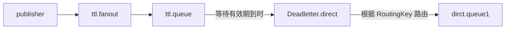

# Rabbit 高级

>  确保MQ消息的可靠性，即：消息应该至少被消费者处理1次

> 消息丢失要从生产者、MQ、消费者三方面防止。
>
> - 生产者重试机制：通过配置文件开启
> - 生产者确认机制：`Publisher Confirm`和`Publisher Return`，通过配置文件开启，并且定义 ReturnCallback 和 ConfirmCallback
>   - Publisher Confirm :用于确认消息是否成功到达 RabbitMQ 服务器。
>   - Publisher Return :用于处理不可路由的消息。
> - 增加 MQ 的可靠性：通过控制台配置
>   - 数据（交换机、队列、消息）持久化
>   - 惰性队列 LazyQueue
> - 消费者确认机制：返回回执（ack、nack、reject）通过配置文件开启处理
> - 失败重试机制：通过配置文件开启
> - 失败处理策略：`MessageRecovery`接口的三个实现
> - 延迟消息：死信队列
>
> 


消息从生产者到消费者的每一步都可能导致消息丢失：

- 发送消息时丢失：
  - 生产者发送消息时连接 MQ 失败
  - 生产者发送消息到达 MQ 后未找到`Exchange`
  - 生产者发送消息到达 MQ 的`Exchange`后，未找到合适的`Queue`
  - 消息到达MQ后，处理消息的进程发生异常
- MQ导致消息丢失：
  - 消息到达MQ，保存到队列后，尚未消费就突然宕机
- 消费者处理消息时：
  - 消息接收后尚未处理突然宕机
  - 消息接收后处理过程中抛出异常


综上，要解决消息丢失问题，保证 MQ 的可靠性，就必须从3个方面入手：

- 确保生产者一定把消息发送到 MQ
- 确保 MQ 不会将消息弄丢
- 确保消费者一定要处理消息


## 1. 发送者的可靠性

### 1. 生产者重试机制

首先第一种情况，就是生产者发送消息时，出现了网络故障，导致与MQ的连接中断。

为了解决这个问题，SpringAMQP 提供的消息发送时的重试机制。即：当 `RabbitTemplate  ` 与 MQ 连接超时后，多次重试。

只需要在 yml 文件中加入如下配置：

```YAML
spring:
  rabbitmq:
    connection-timeout: 1s # 设置MQ的连接超时时间
    template:
      retry:
        enabled: true # 开启超时重试机制
        initial-interval: 1000ms # 失败后的初始等待时间
        multiplier: 1 # 失败后下次的等待时长倍数，下次等待时长 = initial-interval * multiplier
        max-attempts: 3 # 最大重试次数
```


**注意**：当网络不稳定的时候，利用重试机制可以有效提高消息发送的成功率。不过 SpringAMQP 提供的重试机制是**阻塞式**的重试，也就是说多次重试等待的过程中，当前线程是被阻塞的。

如果对于业务性能有要求，建议禁用重试机制。如果一定要使用，请合理配置等待时长和重试次数，当然也可以考虑使用异步线程来执行发送消息的代码。


### 2. 生产者确认机制

> 确认消息是否投递成功（投递给 MQ） 返回 ack 或 nack
>
> 消息投递成功后是否出现了其他错误（Exchange 没找到、Queue 没找到、RoutingKey匹配错误）

一般情况下，只要生产者与 MQ 之间的网路连接顺畅，基本不会出现发送消息丢失的情况，因此大多数情况下我们无需考虑这种问题。

不过，在少数情况下，也会出现消息发送到 MQ 之后丢失的现象，比如：

- MQ 内部处理消息的进程发生了异常
- 生产者发送消息到达 MQ 后未找到 `Exchange`
- 生产者发送消息到达 MQ 的 `Exchange`后，未找到合适的 `Queue`，因此无法路由

针对上述情况，RabbitMQ 提供了生产者消息确认机制，包括 `Publisher Confirm`和 `Publisher Return` 两种。在开启确认机制的情况下，当生产者发送消息给 MQ 后，MQ会根据消息处理的情况返回不同的 **回执**。（ACK、NACK）

> - 当消息投递到 MQ，没有找到交换机，会返回 nack。
> - 当消息投递到 MQ，但是路由失败时，通过 **Publisher Return** 返回异常信息，同时返回 ack 的确认信息，代表投递成功
> - 临时消息投递到了 MQ，并且入队成功，返回 ACK，告知投递成功
> - 持久消息投递到了 MQ，并且入队完成持久化，返回 ACK，告知投递成功
> - 其它情况都会返回 NACK，告知投递失败。
>
> 只要发送到交换机就会返回 ACK。进入交换机的消息没有正确入队就会返回异常信息。

> - Basic.Ack：当 RabbitMQ 成功接收到生产者发送的消息时，它会向生产者发送一个 Basic.Ack 命令，表示消息已经被成功接收并准备进行后续的路由操作（比如发送到队列）。这里的 ACK 只是表明消息被 RabbitMQ 成功接收，并不保证它已经被路由到队列或者入队成功。消息是否能够被路由到队列还取决于交换机和队列的配置以及是否有匹配的绑定。
>
> - Basic.Return：如果消息无法被路由到任何队列（例如，没有匹配的绑定或队列不存在），RabbitMQ 会触发一个 Return 回调，并将消息返回给生产者。Return回调是通过 Basic.Return 命令实现的，生产者需要实现相应的回调函数来处理这种情况。
> - confirm机制，消息的确认，是指生产者投递消息之后，如果Broker收到消息，则会给生产者一个应答，生产者能接收应答，用来确定这条消息是否正常的发送到Broker，这种机制是消息可靠性投递的核心保障。confirm机制是只保证消息到达exchange，并不保证消息可以路由到正确的queue。


> 消息一旦到达交换机就代表消息投递成功了，消息投递成功返回 ACK
>
> 消息从发送者到交换机的时候出现了问题，就代表消息投递失败了返回 NACK
>
> return 机制，用于处理一些不可路由的消息，在一些特殊的情况下，当前的 exchange 不存在或者指定的路由 key 路由不到，这时如果需要及时监听这种消息，就需要 return 机制。


其中 `ack` 和 `nack` 属于 **Publisher Confirm** 机制，`ack `是投递成功；`nack `是投递失败。而 `return` 则属于 **Publisher Return** 机制。

默认两种机制都是关闭状态，需要通过配置文件来开启：

**开启配置：**

```YAML
spring:
  rabbitmq:
    publisher-confirm-type: correlated # 开启publisher confirm机制，并设置confirm类型
    publisher-returns: true # 开启publisher return机制
```

这里`publisher-confirm-type`有三种模式可选：

- `none`：关闭confirm机制
- `simple`：同步阻塞等待 MQ 的回执
- `correlated`：MQ 异步回调返回回执

一般推荐使用 `correlated`，回调机制。

>  ConfirmCallback是保证发送到交换机了；ReturnCallback是保证路由到队列了

#### 定义 ReturnCallback

每个`RabbitTemplate` 只能配置一个 `ReturnCallback` ，因此可以在配置类中统一设置。在 publisher 模块定义一个配置类：

```java
@Slf4j
@AllArgsConstructor
@Configuration
public class MqConfig {
    private final RabbitTemplate rabbitTemplate;

    @PostConstruct
    public void init(){
        rabbitTemplate.setReturnsCallback(new RabbitTemplate.ReturnsCallback() {
            @Override
            public void returnedMessage(ReturnedMessage returned) {
                log.error("触发return callback,");
                log.debug("exchange: {}", returned.getExchange());
                log.debug("routingKey: {}", returned.getRoutingKey());
                log.debug("message: {}", returned.getMessage());
                log.debug("replyCode: {}", returned.getReplyCode());
                log.debug("replyText: {}", returned.getReplyText());
            }
        });
    }
}
```


#### 定义 ConfirmCallback

由于每个消息发送时的处理逻辑不一定相同，因此 ConfirmCallback 需要在每次发消息时定义。具体来说，是在调用 RabbitTemplate 中的 convertAndSend 方法时，多传递一个参数：CorrelationData， CorrelationData 中包含两个核心的东西：

- `id`：消息的唯一标示，MQ 对不同的消息的回执以此做判断，避免混淆
- `SettableListenableFuture`：回执结果的 Future 对象

将来 MQ 的回执就会通过这个 `Future` 来返回，可以提前给 `CorrelationData` 中的 `Future` 添加回调函数来处理消息回执：

```java
@Test
void testPublisherConfirm() {
    // 1.创建 CorrelationData (相关数据)
    CorrelationData cd = new CorrelationData();
    // 2.给 Future 添加ConfirmCallback
    cd.getFuture().addCallback(new ListenableFutureCallback<CorrelationData.Confirm>() {
        @Override
        public void onFailure(Throwable ex) {
            // 2.1.Future发生异常时的处理逻辑，基本不会触发
            log.error("send message fail", ex);
        }
        @Override
        public void onSuccess(CorrelationData.Confirm result) {
            // 2.2.Future接收到回执的处理逻辑，参数中的result就是回执内容
            if(result.isAck()){ // result.isAck()，boolean类型，true代表ack回执，false 代表 nack回执
                log.debug("发送消息成功，收到 ack!");
            }else{ // result.getReason()，String类型，返回nack时的异常描述
                log.error("发送消息失败，收到 nack, reason : {}", result.getReason());
            }
        }
    });
    // 3.发送消息
    rabbitTemplate.convertAndSend("hmall.direct", "q", "hello", cd);
}
```

传递的 `RoutingKey` 如果是错误的，路由失败后，触发了`return callback`，同时也收到了 ack 。

修改为正确的 `RoutingKey` 以后，就不会触发 `return callback` 了，只收到 ack。

而如果连交换机都是错误的，则只会收到 nack。


## 2. MQ 的可靠性

消息到达 MQ 以后，如果 MQ 不能及时保存，也会导致消息丢失，所以 MQ 的可靠性也非常重要。


### 2.1数据持久化

为了提升性能，默认情况下 MQ 的数据都是在内存存储的临时数据，重启后就会消失。为了保证数据的可靠性，必须配置数据持久化，包括：

- 交换机持久化
- 队列持久化
- 消息持久化


交换机和队列的数据持久化可以通过控制台配置`Durability`来实现消息的持久化 


> 设置为`Durable`就是持久化模式，`Transient`就是临时模式。

而消息的持久化需要配置`properties`:


> **说明**：在开启持久化机制以后，如果同时还开启了生产者确认，那么 MQ 会在消息持久化以后才发送 ACK 回执，进一步确保消息的可靠性。
>
> 不过出于性能考虑，为了减少 IO 次数，发送到 MQ 的消息并不是逐条持久化到数据库的，而是每隔一段时间批量持久化。一般间隔在 100 毫秒左右，这就会导致ACK有一定的延迟，因此建议生产者确认全部采用异步方式。


### 2. LazyQueue

在默认情况下，RabbitMQ 会将接收到的信息保存在内存中以降低消息收发的延迟。但在某些特殊情况下，这会导致消息积压，比如：

- 消费者宕机或出现网络故障
- 消息发送量激增，超过了消费者处理速度
- 消费者处理业务发生阻塞

一旦出现消息堆积问题，RabbitMQ 的内存占用就会越来越高，直到触发内存预警上限。此时 RabbitMQ 会将内存消息刷到磁盘上，这个行为成为 `PageOut`. `PageOut ` 会耗费一段时间，并且会阻塞队列进程。因此在这个过程中 RabbitMQ 不会再处理新的消息，生产者的所有请求都会被阻塞。

为了解决这个问题，从 RabbitMQ 的3.6.0版本开始，就增加了 Lazy Queues 的模式，也就是惰性队列。惰性队列的特征如下：

- 接收到消息后直接存入磁盘而非内存
- 消费者要消费消息时才会从磁盘中读取并加载到内存（也就是懒加载）
- 支持数百万条的消息存储

> 而在3.12版本之后，LazyQueue已经成为所有队列的默认格式。


#### 1. 在控制台配置 Lazy 模式：

在添加队列的时候，添加`x-queue-mod=lazy`参数即可设置队列为Lazy模式：


#### 2. 在代码中配置 Lazy 模式

在利用 SpringAMQP 声明队列的时候，添加 `x-queue-mod=lazy` 参数也可设置队列为 Lazy 模式：

```Java
@Bean
public Queue lazyQueue(){
    return QueueBuilder
            .durable("lazy.queue")
            .lazy() // 开启Lazy模式
            .build();
}
```

这里是通过 `QueueBuilder` 的 `lazy()` 函数配置Lazy模式/。


注解声明 Lazy 模式：

```Java
@RabbitListener(queuesToDeclare = @Queue(
        name = "lazy.queue",
        durable = "true",
        arguments = @Argument(name = "x-queue-mode", value = "lazy")
))
public void listenLazyQueue(String msg){
    log.info("接收到 lazy.queue的消息：{}", msg);
}
```


#### 更新已有队列为 Lazy 模式

对于已经存在的队列，也可以配置为lazy模式，但是要通过设置policy实现。

可以基于命令行设置policy：

```Shell
rabbitmqctl set_policy Lazy "^lazy-queue$" '{"queue-mode":"lazy"}' --apply-to queues  
```

命令解读：

- `rabbitmqctl` ：RabbitMQ的命令行工具
- `set_policy` ：添加一个策略
- `Lazy` ：策略名称，可以自定义
- `"^lazy-queue$"` ：用正则表达式匹配队列的名字
- `'{"queue-mode":"lazy"}'` ：设置队列模式为lazy模式
- `--apply-to queues`：策略的作用对象，是所有的队列


当然，也可以在控制台配置policy，进入在控制台的`Admin`页面，点击`Policies`，即可添加配置：


## 3. 消费者的可靠性

当 RabbitMQ 向消费者投递消息以后，需要知道消费者的处理状态如何。因为消息投递给消费者并不代表就一定被正确消费了，可能出现的故障有很多，比如：

- 消息投递的过程中出现了网络故障
- 消费者接收到消息后突然宕机
- 消费者接收到消息后，因处理不当导致异常
- ...

一旦发生上述情况，消息也会丢失。因此，RabbitMQ 必须知道消费者的处理状态，一旦消息处理失败才能重新投递消息。


### 1. 消费者确认机制

为了确认消费者是否成功处理消息，RabbitMQ 提供了消费者确认机制（**Consumer Acknowledgement**）。即：**当消费者处理消息结束后**，应该向 RabbitMQ 发送一个回执，告知 RabbitMQ 自己消息处理状态。回执有三种可选值：

- ack：成功处理消息，RabbitMQ 从队列中删除该消息
- nack：消息处理失败，RabbitMQ 需要再次投递消息
- reject：消息处理失败并拒绝该消息，RabbitMQ 从队列中删除该消息

一般 reject 方式用的较少，除非是消息格式有问题，那就是开发问题了。因此大多数情况下需要将消息处理的代码通过 `try catch` 机制捕获，消息处理成功时返回 ack，处理失败时返回 nack.


由于消息回执的处理代码比较统一，因此 SpringAMQP 实现了消息确认。并允许通过配置文件设置 ACK 处理方式，有三种模式：

- **`none`**：不处理。即消息投递给消费者后立刻 ack，消息会立刻从 MQ 删除。非常不安全，不建议使用
- **`manual`**：手动模式。需要自己在业务代码中调用api，发送 `ack` 或 `reject` ，存在业务入侵，但更灵活
- **`auto`**：自动模式。SpringAMQP 利用 AOP 对我们的消息处理逻辑做了环绕增强，当业务正常执行时则自动返回 `ack`.  当业务出现异常时，根据异常判断返回不同结果：
  - 如果是**业务异常**，会自动返回`nack`；
  - 如果是**消息处理或校验异常**，自动返回`reject`;


通过下面的配置可以修改 SpringAMQP 的 ACK 处理方式：

```YAML
spring:
  rabbitmq:
    listener:
      simple:
        acknowledge-mode: none # 不做处理、 auto 自动ack
```


#### 2. 失败重试机制

当消费者出现异常后，消息会不断 requeue（重入队）到队列，再重新发送给消费者。如果消费者再次执行依然出错，消息会再次requeue到队列，再次投递，直到消息处理成功为止。

极端情况就是消费者一直无法执行成功，那么消息 requeue 就会无限循环，导致 mq 的消息处理飙升，带来不必要的压力。Spring 提供了消费者失败重试机制：在消费者出现异常时利用本地重试，而不是无限制的 requeue 到 mq 队列。

修改 consumer 服务的 application.yml 文件，添加内容：

```YAML
spring:
  rabbitmq:
    listener:
      simple:
        retry:
          enabled: true # 开启消费者失败重试
          initial-interval: 1000ms # 初识的失败等待时长为 1 秒
          multiplier: 1 # 失败的等待时长倍数，下次等待时长 = multiplier * last-interval
          max-attempts: 3 # 最大重试次数
          stateless: true # true无状态；false有状态。如果业务中包含事务，这里改为false
```

重启 consumer 服务，进行测试。可以发现：

- 消费者在失败后消息没有重新回到 MQ 无限重新投递，而是在本地重试了 3 次
- 本地重试 3 次以后，抛出了`AmqpRejectAndDontRequeueException`异常。查看 RabbitMQ 控制台，发现消息被删除了，说明最后 SpringAMQP 返回的是`reject`

结论：

- 开启本地重试时，消息处理过程中抛出异常，不会 requeue 到队列，而是在消费者本地重试
- 重试达到最大次数后，Spring 会返回 reject，消息会被丢弃


### 3.失败处理策略

本地测试达到最大重试次数后，消息会被丢弃。这在某些对于消息可靠性要求较高的业务场景下，显然不太合适了。

因此 Spring 允许自定义重试次数耗尽后的消息处理策略，这个策略是由`MessageRecovery`接口来定义的，它有3个不同实现：

-  `RejectAndDontRequeueRecoverer`：重试耗尽后，直接`reject`，丢弃消息。默认就是这种方式 
-  `ImmediateRequeueMessageRecoverer`：重试耗尽后，返回`nack`，消息重新入队 
-  `RepublishMessageRecoverer`：重试耗尽后，将失败消息投递到指定的交换机 

比较优雅的一种处理方案是`RepublishMessageRecoverer`，失败后将消息投递到一个指定的，专门存放异常消息的队列，后续由人工集中处理。


需要声明一个专门存放异常消息的队列：

```Java
@Configuration
@ConditionalOnProperty(name = "spring.rabbitmq.listener.simple.retry.enabled", havingValue = "true")
public class ErrorMessageConfig {
    @Bean
    public DirectExchange errorMessageExchange(){
        return new DirectExchange("error.direct");
    }
    @Bean
    public Queue errorQueue(){
        return new Queue("error.queue", true);
    }
    @Bean
    public Binding errorBinding(Queue errorQueue, DirectExchange errorMessageExchange){
        return BindingBuilder.bind(errorQueue).to(errorMessageExchange).with("error");
    }

    @Bean
    public MessageRecoverer republishMessageRecoverer(RabbitTemplate rabbitTemplate){
        return new RepublishMessageRecoverer(rabbitTemplate, "error.direct", "error");
    }
}
```


### 4. 业务幂等性

幂等：在程序开发中，则是指同一个业务，执行一次或多次对业务状态的影响是一致的。删除、查询、新增数据都是幂等的，但是更新数据往往不是幂等的。

保证消息处理的幂等性。这里给出三种方案：

- 唯一消息ID：开启 SpringAMQP 的 MessageConverter 自带的 MessageID 功能
- 业务状态判断：使用乐观锁实现
- 定时任务：如每隔 20 秒就查询一次，达到修改状态的条件时修改状态即可。


> **唯一消息 ID：**
>
> 1. 每一条消息都生成一个唯一的 id，与消息一起投递给消费者。
> 2. 消费者接收到消息后处理自己的业务，业务处理成功后将消息 ID 保存到数据库。
> 3. 如果下次又收到相同消息，去数据库查询判断是否存在，存在则为重复消息放弃处理。

```Java
@Bean
public MessageConverter messageConverter(){
    // 1.定义消息转换器
    Jackson2JsonMessageConverter jjmc = new Jackson2JsonMessageConverter();
    // 2.配置自动创建消息id，用于识别不同消息，也可以在业务中基于ID判断是否是重复消息
    jjmc.setCreateMessageIds(true);
    return jjmc;
}
```


**业务逻辑：**

```sql
update tableName set status = ? where id = ? and status = 1;
```


## 4. 延时消息

假如用户下单后一直不付款，就会一直占有库存资源，导致其他客户无法正常交易，最终导致商户利益受损！电商中通常的做法就是：**对于超过一定时间未支付的订单，应该立刻取消订单并释放占用的库存**。


在一段时间以后才执行的任务称之为**延迟任务**，而要实现延迟任务，最简单的方案就是利用 MQ 的延迟消息了。

在 RabbitMQ 中实现延迟消息也有两种方案：

- 死信交换机+ TTL
- 延迟消息插件


### 1. 死信交换机和延迟消息

#### 1.1 死信与死信交换机

> 死信：
>
> 当一个队列中的消息满足下列情况之一时，可以成为死信（dead letter）：
>
> - 消费者使用 `basic.reject` 或  `basic.nack` 声明消费失败，并且消息的 `requeue` 参数设置为 false
> - 消息是一个过期消息，超时无人消费
> - 要投递的队列消息满了，无法投递


如果一个队列中的消息已经成为死信，并且这个队列通过**`dead-letter-exchange`**属性指定了一个交换机，那么队列中的死信就会投递到这个交换机中，而这个交换机就称为**死信交换机**（Dead Letter Exchange）。而此时假如有队列与死信交换机绑定，则最终死信就会被投递到这个队列中。

死信交换机有什么作用呢？

1. 收集那些因处理失败而被拒绝的消息
2. 收集那些因队列满了而被拒绝的消息
3. 收集因 TTL（有效期）到期的消息


#### 1.2 延时消息





某个队列等待 设定的有效期后没有被消费，变成了死信，此时要投递给死信交换机，死信交换机再发送给与之绑定的队列（通过RoutingKey 确定是哪个队列），之后发送给消费者，完成延时消息。


> **注意：**
>
> RabbitMQ 的消息过期是基于追溯方式来实现的，也就是说当一个消息的 TTL 到期以后不一定会被移除或投递到死信交换机，而是在消息恰好处于队首时才会被处理。
>
> 当队列中消息堆积很多的时候，过期消息可能不会被按时处理，因此你设置的 TTL 时间不一定准确。


### 2. DelayExchange插件

> RabbitMQ社区提供了一个延迟消息插件来实现相同的效果（基于死信队列实现延迟消息）。

下载地址：[rabbitmq/rabbitmq-delayed-message-exchange: Delayed Messaging for RabbitMQ (github.com)](https://github.com/rabbitmq/rabbitmq-delayed-message-exchange)

> 需要注意版本号，RabbitMQ 和相关插件的版本不能相差太大。


#### 1.基于 Docker 安装

1. 先查看RabbitMQ的插件目录对应的数据卷。

```powershell
docker volume inspect mq-plugins
```

2. 找到挂载点，`"Mountpoint": "/var/lib/docker/volumes/mq-plugins/_data"`

3. 上传插件到该目录下;

4. 执行如下命令，安装插件：

```Shell
docker exec -it mq rabbitmq-plugins enable rabbitmq_delayed_message_exchange
```


#### 2.声明延迟交换机

基于注解：

```Java
@RabbitListener(bindings = @QueueBinding(
        value = @Queue(name = "delay.queue", durable = "true"),
        exchange = @Exchange(name = "delay.direct", delayed = "true"),
        key = "delay"
))
public void listenDelayMessage(String msg){
    log.info("接收到delay.queue的延迟消息：{}", msg);
}
```


基于`@Bean`的方式：

```Java
package com.itheima.consumer.config;

import lombok.extern.slf4j.Slf4j;
import org.springframework.amqp.core.*;
import org.springframework.context.annotation.Bean;
import org.springframework.context.annotation.Configuration;

@Slf4j
@Configuration
public class DelayExchangeConfig {

    @Bean
    public DirectExchange delayExchange(){
        return ExchangeBuilder
                .directExchange("delay.direct") // 指定交换机类型和名称
                .delayed() // 设置delay的属性为true
                .durable(true) // 持久化
                .build();
    }

    @Bean
    public Queue delayedQueue(){
        return new Queue("delay.queue");
    }
    
    @Bean
    public Binding delayQueueBinding(){
        return BindingBuilder.bind(delayedQueue()).to(delayExchange()).with("delay");
    }
}
```


#### 3.发送延时消息

发送消息时，必须通过 x-delay 属性设定延迟时间：

```Java
@Test
void testPublisherDelayMessage() {
    // 1.创建消息
    String message = "hello, delayed message";
    // 2.发送消息，利用消息后置处理器添加消息头
    rabbitTemplate.convertAndSend("delay.direct", "delay", message, new MessagePostProcessor() {
        @Override
        public Message postProcessMessage(Message message) throws AmqpException {
            // 添加延迟消息属性
            message.getMessageProperties().setDelay(5000);
            return message;
        }
    });
}
```


```java
rabbitTemplate.converAndSend(
    exchangeName,RoutingKey,message,
    message->{
        message.getMessageProperties().setDelay(10000);
        return message;
    }
)
```


> **注意：**
>
> 延迟消息插件内部会维护一个本地数据库表，同时使用 Elang Timers 功能实现计时。如果消息的延迟时间设置较长，可能会导致堆积的延迟消息非常多，会带来较大的 CPU 开销，同时延迟消息的时间会存在误差。
>
> 因此，**不建议设置延迟时间过长的延迟消息**。


