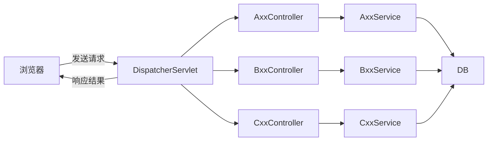
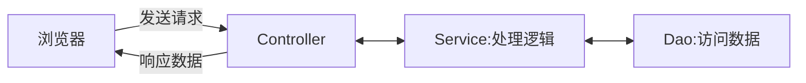

# SpringBoot 从 0 到 1

程序 = 数据结构 + 算法                      ✔

程序 = 面向对象 + 框架                      码农必配


自定义异常继承RuntimeException类，定义code和description，重载构造和函数，调用父类的构造器RuntimeExcepuotion super.（String message）;

全局异常处理器：使用注解@RestControllerAdvice修饰异常处理器，使用ExceptionHandler注解修饰方法，标识处理什么类型的异常，方法的返回值为自定义异常，返回ResultUtils类型的返回值


## SpringBoot 介绍

### 1.介绍

- SpringBoot 可以帮助我们非常快速的构建应用程序、简化开发、提高效率 。
- SpringBoot Web项目是基于 tomcat 服务器运行的，在 SpringBoot 引入 web 环境时就集成了内置的 tomcat 服务器。

> 在 SpringBoot 进行 web 程序开发时，它内置了一个核心的 Servlet 程序 DispatcherServlet，称之为 核心控制器。 DispatcherServlet 负责接收页面发送的请求，然后根据执行的规则，将请求再转发给后面的请求处理器 Controller，请求处理器处理完请求之后，最终再由 DispatcherServlet 给浏览器响应数据。
>
> 浏览器发送请求，会携带请求数据，包括：请求行、请求头；请求到达 tomcat 之后，tomcat 会负责解析这些请求数据，然后呢将解析后的请求数据会传递给 Servlet 程序的 HttpServletRequest 对象，那也就意味着 HttpServletRequest 对象就可以获取到请求数据。 而 Tomcat ，还给 Servlet 程序传递了一个参数 HttpServletResponse，通过这个对象，我们就可以给浏览器设置响应数据 。




**类路径**

> 在SpringBoot项目中，静态资源默认可以存放的目录：
>
> - classpath:/static/
> - classpath:/public/
> - classpath:/resources/
> - classpath:/META-INF/resources/
>
> classpath：
>
> - 代表的是类路径，在maven的项目中，其实指的就是 src/main/resources 或者 src/main/java，但是java目录是存放java代码的，所以相关的配置文件及静态资源文档，就放在 src/main/resources下。


### 2. 原则

在 SpringBoot 开发中的原则

> - 软件设计原则：高内聚低耦合。
>
>   - 高内聚指的是：一个模块中各个元素之间的联系的紧密程度，如果各个元素(语句、程序段)之间的联系程度越高，则内聚性越高，即 "高内聚"。
>
>     >`三层架构`是实现软件系统高内聚的关键
>
>   - 低耦合指的是：软件中各个层、模块之间的依赖关联程序越低越好。
>
>     >`IOC和DI`是实现软件系统低耦合的关键。
>
> - 单一职责原则：一个类或一个方法，就只做一件事情，只管一块功能。（分层解耦）
>
> - 约定优于配置原则：强调在开发框架或工具中，通过约定来减少配置的需求，从而提高开发者的生产力和代码的可维护性。（自动注入第三方Bean，开箱即用；尽量减少开发者需要进行的显式配置，将配置的工作交给框架或工具来完成。）
>
>   - **关于第三方Bean**：在原来的 Spring 中需要在 XML 文件中配置 Bean 整合第三方 Bean ，或者通过 @Configuration  注解配置 Bean，但是在 SpringBoot 中，这个步骤可以省略。原因在于SprimngBoot会自动配置。
>
> - 


### 3. HTTP协议

#### 3.1 HTTP请求协议

**请求协议：**浏览器将数据以请求格式发送到服务器

- 包括：**请求行**、**请求头** 、**请求体** 

在HTTP1.1版本常用的浏览器访问服务器的方式： 

|  请求方式  | 请求说明                               |
| :--------: | :------------------------------------- |
|  **GET**   | 获取资源。                             |
|  **POST**  | 传输实体主体。（登录注册等等使用Post） |
|  **PUT**   | 传输文件。                             |
| **DELETE** | 删除文件。                             |

GET请求和POST请求的区别：

| 区别方式     | GET请求                                                      | POST请求             |
| ------------ | ------------------------------------------------------------ | -------------------- |
| 请求参数     | 请求参数在请求行中。<br/>例：/brand/findAll?name=OPPO&status=1 | 请求参数在请求体中   |
| 请求参数长度 | 请求参数长度有限制(浏览器不同限制也不同)                     | 请求参数长度没有限制 |
| 安全性       | 安全性低。原因：请求参数暴露在浏览器地址栏中。               | 安全性相对高         |

#### 3.2 HTTP 响应协议

**响应协议：**服务器将数据以响应格式返回给浏览器

- 包括：**响应行** 、**响应头** 、**响应体** 

**响应状态码**

这里的客户端指的是前端，服务端指的是后端

| 状态码分类 | 说明                                                         |
| ---------- | ------------------------------------------------------------ |
| 1xx        | **响应中** --- 临时状态码。表示请求已经接受，告诉客户端应该继续请求或者如果已经完成则忽略 |
| 2xx        | **成功** --- 表示请求已经被成功接收，处理已完成              |
| 3xx        | **重定向** --- 重定向到其它地方，让客户端再发起一个请求以完成整个处理 |
| 4xx        | **客户端错误** --- 处理发生错误，责任在客户端，如：客户端的请求一个不存在的资源，客户端未被授权，禁止访问等 |
| 5xx        | **服务器端错误** --- 处理发生错误，责任在服务端，如：服务端抛出异常，路由出错，HTTP版本不支持等 |

详见如下

| 状态码  | 英文描述                               | 解释                                                         |
| ------- | -------------------------------------- | ------------------------------------------------------------ |
| 200     | **`OK`**                               | 客户端请求成功，即**处理成功**，这是我们最想看到的状态码     |
| 302     | **`Found`**                            | 指示所请求的资源已移动到由`Location`响应头给定的 URL，浏览器会自动重新访问到这个页面 |
| 304     | **`Not Modified`**                     | 告诉客户端，你请求的资源至上次取得后，服务端并未更改，你直接用你本地缓存吧。隐式重定向 |
| 400     | **`Bad Request`**                      | 客户端请求有**语法错误**，不能被服务器所理解                 |
| 403     | **`Forbidden`**                        | 服务器收到请求，但是**拒绝提供服务**，比如：没有权限访问相关资源 |
| 404     | **`Not Found`**                        | **请求资源不存在**，一般是URL输入有误，或者网站资源被删除了  |
| 405     | **`Method Not Allowed`**               | 请求方式有误，比如应该用GET请求方式的资源，用了POST          |
| 428     | **`Precondition Required`**            | **服务器要求有条件的请求**，告诉客户端要想访问该资源，必须携带特定的请求头 |
| 429     | **`Too Many Requests`**                | 指示用户在给定时间内发送了**太多请求**（“限速”），配合 Retry-After(多长时间后可以请求)响应头一起使用 |
| 431     | **` Request Header Fields Too Large`** | **请求头太大**，服务器不愿意处理请求，因为它的头部字段太大。请求可以在减少请求头域的大小后重新提交。 |
| ==500== | **`Internal Server Error`**            | **服务器发生不可预期的错误**。服务器出异常了，赶紧看日志去吧 |
| 503     | **`Service Unavailable`**              | **服务器尚未准备好处理请求**，服务器刚刚启动，还未初始化好   |

状态码大全：https://cloud.tencent.com/developer/chapter/13553 

SpringBoot 开发中的分层解耦


## 一、SpringBoot 配置文件

### 1.配置文件介绍

> SpringBoot 配置文件是用于管理应用程序的`配置信息`的文件。开发者可以通过`配置文件`灵活地调整应用程序的行为和属性，而无需硬编码这些值到源代码中。这使得应用具备更好的可移植性、易维护性和环境适应能力。
>
> - 该配置文件写在 `src/main/resource` 文件夹下

SpringBoot 配置文件的主要作用如下：

- **数据源配置**：配置数据库的连接信息（URL、端口号、用户密码、数据库）；
- **服务器配置**：配置 tomcat 的启动端口、上下文路径；
- **外部服务集成**：如集成Swagger、Knife4j文档、集成Redis等等其他第三方访问密钥和地址
- **profiles支持**：根据不同的运行环境（开发、测试、生产）使用不同的配置。
- ......

SpringBoot配置文件有多种，常用的有 .xml文件、.properties 文件、yml 文件（`.yaml`和`.yml`）

- application.properties

  ```properties
  server.port=8080
  server.address=127.0.0.1
  ```

- application.yaml 

  ```yml
  server:
    port: 8080
    address: 127.0.0.1
  ```

- application.yml 

  ```yml
  server:
    port: 8080
    address: 127.0.0.1
  ```

推荐使用` yml `文件（.yml），因为 yml 文件简单简洁

yml配置文件的基本语法：

- 大小写敏感
- 数值前边必须有**空格**，作为分隔符
- 使用缩进表示层级关系，缩进时，不允许使用Tab键，只能用空格（idea中会自动将Tab转换为空格）
- 缩进的空格数目不重要，只要相同层级的元素左侧对齐即可
- `#`表示注释，从这个字符一直到行尾，都会被解析器忽略

### 2. 读取 yml 文件

> 为什么要读yml文件中的内容
>
> - 有时候我们需要在代码中写上某些配置的信息，一旦改变配置还需要在源代码中继续修改，比较繁琐。
> - 如果能把这些配置信息抽取出来放到配置文件 （`yml` 文件）中，只用修改配置文件里面的内容，让相关的配置类在项目启动的时候读取该配置文件中的配置信息继续配置相关Bean。
>
> 怎么实现配置类读取？
>
> - @ConfigurationProperties 注解：顾名思义-->配置的属性

Spring提供的简化方式套路：

1. 需要创建一个实现类，且实体类中的属性名和配置文件当中key的名字必须要一致

   > 比如：配置文件当中叫host，实体类当中的属性也得叫host，
   >
   > 另外实体类当中的属性还需要提供 getter / setter方法

2. 需要将实体类交给Spring的IOC容器管理，成为IOC容器当中的bean对象

3. 在实体类上添加`@ConfigurationProperties`注解，并通过perfect属性来指定配置参数项的前缀

如下配置Redisson案例：

```yml
# 在 yml 文件中配置 Redis 的连接信息：端口为6379，主机地址为localhost、连接第0个数据库
# SpringBoot 3 之后要加上data
spring:
  data:
    redis:
      port: 6379
      host: localhost
      database: 0
```

```java
// 定义第三方Bean时， 通常会单独定义一个配置类
@Configuration // 表示该类为配置类，SpringBoot会在启动时将该类的Bean注入IoC日期中
@ConfigurationProperties(prefix = "spring.data.redis")
@Data // Lombok的注解，自动生成getter、setter方法
public class RedissonConfig {

	private String host;

	private String port;

	@Bean  // 将当前方法的返回值对象交给IOC容器管理, 成为IOC容器bean，bean名称默认是方法名
	public RedissonClient redissonClient(){
		// 1. 创建配置
		Config config = new Config();
		String redisAddress = String.format("redis://%s:%s", host, port);
		config.useSingleServer().setAddress(redisAddress).setDatabase(3);
		// 2. 创建实例
		RedissonClient redisson = Redisson.create(config);
		return redisson;
	}
}
```


## 二、整合依赖

- ==每一次引入一个依赖都使用一个小 demo 测试一下是否能使用==

----

使用 maven 初始化 SpringBoot 项目

> 推荐引入的依赖：
>
> - `log4j`依赖：用于日志输出
> - `Lombok`依赖：相关的注解可以自动生成 getter、 setter、 equals、 hashCode 和 toString 方法，提高开发效率
>   - @Data 注解：可以生成自动生成 getter、 setter方法
>   - @Slf4j 注解：可以在程序中使用 log.info / error("日志信息") 在控制台输出日志信息
> - `Juint`依赖：Java的单元测试框架

### 1. MyBatis 或 MyBatis-Plus 

> 整合 MyBatis-Plus 不需要再整合 MyBatis 。
>
> - 注意整合 MyBatis 依赖实现分页返回结果还要在 maven 中引入 `PageHelper` 插件，而MyBatis-Plus 有着自己的分页查询，需要通过配置才能使用。
>
> - MyBatis-Plus 是 MyBatis 的一个增强工具，在 MyBatis 的基础上只做增强不做改变，为简化开发、提高效率而生。 

MyBatis 中文网：[MyBatis中文网](https://mybatis.net.cn/)

MyBatis-Plus 官网：[MyBatis-Plus (baomidou.com)](https://baomidou.com/)

1. 在 pom.xml 文件中引入如下依赖，版本号可以自己选择（正常情况下可以运行，否则就要更换依赖的版本）：
   
   > MyBatis-Plus有些版本会出现莫名其妙的错误（如下），更换版本便可以解决
   >
   > ```
   > org.apache.ibatis.binding.BindingException: Invalid bound statement (not found): com.xxx.xxx.mapper.UserMapper.selectList   
   > ```
   >
   > 
   
   ```xml
   <!--整合 MyBatis -->
   <dependency>
       <groupId>org.mybatis.spring.boot</groupId>
       <artifactId>mybatis-spring-boot-starter</artifactId>
       <version>3.0.3</version>
   </dependency>
   <!--整合 MyBatis-Plus，注意这里的spring-boot3，因为项目是基于SpringBoot3开发的-->
   <dependency>
       <groupId>com.baomidou</groupId>
       <artifactId>mybatis-plus-spring-boot3-starter</artifactId>
       <version> 3.5.5</version>
   </dependency>
   <!--既然要操作MySQL数据库，就要引入MySQL驱动-->
   <dependency>
       <groupId>com.mysql</groupId>
       <artifactId>mysql-connector-j</artifactId>
       <scope>runtime</scope>
   </dependency>
   ```
   
2. 在 application.yml 文件中配置数据库的连接信息

   ```yaml
   spring:
     datasource:
       url: jdbc:mysql://localhost:3306/“需要操作的数据库”
       username: root
       driver-class-name: com.mysql.cj.jdbc.Driver
       password: "012345"
       # 有没有发现这里的密码加上了双引号？
       # 密码首位为0时，在连接数据库时可能会出现密码错误的情况，原因可能是会将密码解析为八进制数字，导致密码输入错误，解决方案就是加上单引号或者双引号。
   ```

3. 在  application.xml 文件中配置 MyBatis 和或MyBtais-Plus
   ```yaml
   # 整合MyBatis-Plus
   mybatis-plus:
     configuration:
     map-underscore-to-camel-case: true # 开启驼峰转化，数据库表中的下划线式字段转换为对应实体类的驼峰式的属性，MyBatis-Plus是默认开启，但是MyBatis默认是关闭，MyBatis需要加上这条语句
       log-impl: org.apache.ibatis.logging.stdout.StdOutImpl # 在控制台输出 MyBatis-Plus 日志
     global-config:
       db-config:
         logic-delete-field: isDelete # 全局逻辑删除的实体字段名(since 3.3.0,配置后可以忽略不配置步骤2)
         logic-delete-value: 1 # 逻辑已删除值(默认为 1)
         logic-not-delete-value: 0 # 逻辑未删除值(默认为 0)
   # 整合MyBatis      
   mybatis:
     configuration:
       log-impl: org.apache.ibatis.logging.stdout.StdOutImpl
   ```

4. 使用 IDEA 的 MyBatisX 插件（需要自己在Plugins中下载）根据数据库中的表的字段信息自动生成实体类、 Service 层以及 Mapper 层代码
   4.1 安装 MyBtaisX 插件，右击数据库中的`表`，选择`MyBbatisX-Generator`

   

   4.2 配置相关信息，点击 finish 自动生成实体类和 Service 层、 Mapper 层代码
   

   

5. SpringBoot整合 MyBatis 和 MyBatis-Plus 到此结束，你可以通过 Mapper 层的对象进行数据库的操作

6. 为啥不需要配置Bean了呢？SpringBoot 会自动配置 Bean 对象
   **自动配置：**遵循`约定大约配置`的原则，在boot程序启动后，起步依赖中的一些bean对象会自动注入到 IOC 容器中。（ SpringBoot 和相关依赖提前约定好了，相关的操作自动完成，引入之后就可以直接用，不需要再配置了，当然你也可以自己配置）

### 2. Swagger 和 Knife4j

>Swagger 和 Knife4j 都是用于生成和展示 RESTful API 文档的工具，它们可以显著提高前后端团队在开发、测试与维护接口时的效率。

Knife4j 文档官网：[Knife4j · 集Swagger2及OpenAPI3为一体的增强解决方案. | Knife4j (xiaominfo.com)](https://doc.xiaominfo.com/)

注意：`不需要再单独去配置Swagger依赖`

1. 在 pom.xml 文档引入knife4j相关依赖
   ```xml
   <dependency>
       <groupId>com.github.xiaoymin</groupId>
       <artifactId>knife4j-openapi3-jakarta-spring-boot-starter</artifactId>
       <version>4.4.0</version>
   </dependency>
   ```

2. 配置Bean。上面刚刚说了会自动配置了，为啥还要配置？
   
   > SpringBoot 使用的是无参构造器配的Bean
   >
   > 如果想自定义配置Swagger文档和Knife4j文档的相关信息，如接口文档的文档名、作者信息等等，就需要再一次配置Bean。
   
   ```java
   import io.swagger.v3.oas.models.OpenAPI;
   import io.swagger.v3.oas.models.info.Contact;
   import io.swagger.v3.oas.models.info.Info;
   import io.swagger.v3.oas.models.info.License;
   import org.springframework.context.annotation.Bean;
   import org.springframework.context.annotation.Configuration;
   
   /***
    * 创建Swagger配置
    */
   @Configuration
   public class SwaggerConfig {
   	@Bean
   	public OpenAPI customOpenAPI() {
   		return new OpenAPI()
   				.info(new Info()
   						.title("XX系统API")
   						.version("1.0")
   						.contact(new Contact()
   								.email("1234562@qq.com")
   								.url("https://github.com/xxxx")
   								.name("作者姓名"))
   						.description( "系统简介")
   						.termsOfService("https://github.com/xxxx")
   						.license(new License().name("Apache 2.0")
   								.url("https://github.com/xxxx")));
   	}
   
   }
   ```
   
3. 在 application.yml 文件中配置相关信息
   ```yaml
   springdoc:
     swagger-ui:
       path: /swagger-ui.html
       tags-sorter: alpha
       operations-sorter: alpha
     api-docs:
       path: /v3/api-docs
     group-configs:
       - group: 'default'
         paths-to-match: '/**'
         packages-to-scan: com.xxx.xxx.controller   # 控制器所在的包
   ```

4. 按照自己的地址分别访问Swagger文档
   Swagger UI：http://localhost:8080/swagger-ui/index.html
   
   Knife4j页面：http://localhost:8080/doc.html
   
5. 如何在多环境环境下的某个环境隐藏该文档（二选一）
   
      在SpringBoot3.2.1配置Swagger和Knife4j文档之后，为了保障系统的接口安全性，需要在多环境下的某个环境隐藏该文档，方法有两种，一种失效可以用另一种替换（只配置两者的一种即可）：
   - 一种是在`Swagger配置类`上加上 `@Profile({"dev", "其他环境"}) `注解，切换环境之后重启SpringBoot 应用，会无法创建 Swagger 类的 Bean，导致无法访问这两个文档。
      - 另一种是在相关环境的yml文件中`配置production属性`，之后相关的资源会被屏蔽输出（在第一种方式无效的时候再配置）。
        在 yml 文档中配置如下信息
      
         ```yml
         # knife4j的增强配置
         knife4j:
           enable: true
           # 代表在该环境下用户无法访问knife4j和Swagger文档
           production: true
         ```

----

如何使用？

> 不同版本注解不一样，推荐跟着官方文档

1. 在控制器类上加上
   ```java
   @Tag(name = "用户接口") // 表示这个控制器是什么类的接口
   ```

2. 在相关方法上加上
   ```java
   @Operation(summary = "用户注册")// 表示这个方法是什么接口
   ```


## 三、SpringBoot测试

- ==每一次引入一个依赖都使用一个小 demo 测试一下是否能使用==

----

SpringBoot 测试一般使用 `Juint`单元测试框架

SpringBoot测试类一般编写在 `src/test/java` 文件夹下的`SpringBoot启动类相关的包`下 

> 如SpringBoot启动类在：`src/main/java/com.author.project`包中
> 则测试类放在：	     `src/test/java/com.author.project`包中

测试类的编写：

1. 创建测试类
2. 在测试类上添加 `@SpringBootTest` 注解（用于标记一个类为 Spring Boot 应用程序的集成测试类）
3. 编写测试方法（注意：测试方法没有参数、没有返回值）
4. 在测试方法上加上 `@Test` 方法（用于标记一个公共的无参方法为测试方法。）

如下：

```java
@SpringBootTest
public class RedisTemplateTest {
    // 注入RedisTemplate的Bean
	@Resource
	private RedisTemplate redisTemplate;
	@Test
	void test(){
        // 获取 Redis 操作模板（RedisTemplate）的 Value 操作对象
		ValueOperations valueOperations = redisTemplate.opsForValue();
        // 在Redis数据库中添加 键为 name，值为 John 的数据
		valueOperations.set("name","John");
        // 使用断言判断valueOperations.get("name")获取的值是否和期望值（"John"）一样，如果不一样，则报错。
		Assert.assertEquals("John",valueOperations.get("name"));
	}
}
```


## 四、三层架构

### 1. 三层架构

三层架构是实现软件系统**高内聚**的关键

> 处理逻辑从组成上看可以分为三个部分：

- 请求处理、响应数据：负责接收页面的请求，给页面响应数据。
- 逻辑处理：负责业务逻辑处理的代码。
- 数据访问：负责业务数据的维护操作，包括增、删、改、查等操作。


> SpringBoot项目开发中也将代码分成三层

- Controller：控制层。接收前端发送的请求，对请求进行处理，并响应数据。
- Service：业务逻辑层。处理具体的业务逻辑。
- Dao：数据访问层(Data Access Object)，也称为持久层。负责数据访问操作，包括数据的增、删、改、查。
- Mapper：数据访问层


> 基于三层架构的程序执行流程

- 前端发起的请求，由Controller层接收（Controller响应数据给前端）
- Controller层调用Service层来进行逻辑处理（Service层处理完后，把处理结果返回给Controller层）
- Serivce层调用Dao层（逻辑处理过程中需要用到的一些数据要从Dao层获取）
- Dao层操作文件中的数据（Dao拿到的数据会返回给Service层）



浏览器发起请求，先请求Controller；Controller接收到请求之后，调用Service进行业务逻辑处理；Service再调用Dao，Dao再访问数据库中所存储的数据，之后将数据逐层返回。


> 项目结构的三层架构

- 控制层包名：xxxx.controller

  - XxxController

- 业务逻辑层包名：xxxx.service

  - XxxService（接口，为啥需要接口）

    >接口是一种契约，它定义了一组方法签名（包括返回类型、方法名和参数列表），但不包含实现。通过实现接口，一个类必须提供接口中声明的所有方法的具体实现，从而确保了所有实现该接口的类都遵循同一套规则或功能约定。

  - XxxServiceImpl

- 数据访问层包名：xxxx.dao  或者xxx.mapper

  - XxxMapper（接口）
  - /src/main/resources/mapper/XxxMapper.xml

----

#### IOC和DI

IOC和DI是实现软件系统**低耦合**的关键。

- **控制反转：** Inversion Of Control，简称 IOC 。类的对象的创建控制权由程序自身转移到一个容器（称为 IOC 容器），这种思想称为控制反转。

  > 类的对象的创建权（new）由程序员主动创建（new）转移到容器(由容器创建并管理对象)。这个容器称为： IOC 容器或 Spring 容器

  #### 实现

  >在相关类上添加下面注解，注解的作用都是将当前对象交给 IOC 容器管理,成为 IOC 容器的 Bean，
  >IOC容器中存放的 Bean 名称默认为`类名首字母小写`。如： XxxService -->xxxService
  >
  >- @Component 及其衍生注解
  > - @Controller     （标注在控制层类上）
  > - @Service         （标注在业务层类上）
  > - @Repository    （标注在数据访问层类上）
  > - @Mapper         （标注在数据访问层类上，在整合MyBatis后使用）
  >- @RestController     （标注在控制层类上）
  >- @Configuration       （标注在配置类上，但它的作用不仅仅如此）
  > - @Bean
  > - @MapperScan       （标注在主启动类上，扫描 mapper包的Mapper 文件，值为mapper包所在的位置）
  >
  >注意：声明控制器bean只能用@Controller和@RestController。

  注解声明的bean，要想生效，就需要被组件扫描注解 `@ComponentScan` 扫描，而该注解包含在引导类声明注解`@SpringBootApplication` 中，==**默认扫描的范围是SpringBoot启动类所在包及其子包**==。

- **依赖注入：** Dependency Injection，简称 DI 。容器为应用程序提供运行时，所依赖的资源，称之为依赖注入。

  > “依赖”通常指的是应用程序中各个 Bean 或 Bean 对象之间的依赖关系。
  >
  > - Bean对象之间的依赖关系指的是一个 Bean 在执行其功能时需要使用到另一个或多个 Bean 的服务（方法）或者属性。
  >
  > 程序运行时需要某个资源，此时容器就为其提供这个资源。
  >
  > 例：XxxController 程序运行时需要 XxxService 对象，Spring 容器就为其提供并注入 XxxService 对象

  #### 实现

  >- @Autowired 注解：自动装配。在程序运行时 IOC 容器自动注入需要的依赖对象，默认是按照**类型**进行自动装配的。
  >  - @Autowired + @Qualifier注解：指定当前要注入的bean对象。 在@Qualifier的value属性中，指定注入的bean的名称。（@Qualifier注解不能单独使用，必须配合@Autowired使用）
  >- @Resource注解：是按照bean的名称进行注入。通过name属性指定要注入的bean的名称。
  >
  >>  @Autowird 与 @Resource的区别
  >>
  >> - @Autowired 是spring框架提供的注解，而@Resource是JDK提供的注解
  >> - @Autowired 默认是按照类型注入，而@Resource是按照名称注入
  >

### 2. 控制层常用注解

实际上是 Spring MVC 常用注解

> 集合类型参数
>
> - 默认情况下，请求中参数名相同的多个值，是封装到数组。如果要封装到集合，要使用 @RequestParam 绑定参数关系。

**@RequestParam 注解：**@RequestParam 中的 required 属性默认为 true（默认值也是 true），代表该请求参数必须传递，如果不传递将报错。


> 日期类型参数

**@DateTimeFormat 注解：**日期类型的参数在进行封装的时候，需要通过 @DateTimeFormat 注解，以及其 pattern 属性来设置日期的格式。

```java
@DateTimeFormat(pattern = "yyyy-MM-dd HH:mm:ss") LocalDateTime updateTime
```


> JSON 格式参数
>
> 在前后端进行交互时，如果是比较复杂的参数，前后端通过会使用 JSON 格式的数据进行传输。
>
> - JSON 格式的参数存放在`请求体`中

**@RequestBody注解：**

- 接收请求时，将 JSON 数据映射到形参的实体类对象中（JSON 中的 key 和实体类中的属性名保持一致）；
- 返回响应时，如果返回值类型是实体对象/集合，将会转换为 JSON 格式后在响应给浏览器。


**@RestController注解：**混合注解---> @RestController = @Controller + @ResponseBody 

类上有@RestController注解或@ResponseBody注解时：表示当前类下所有的方法返回值做为响应数据

- 方法的返回值如果是一个POJO对象或集合时，会先转换为JSON格式，在响应给浏览器。


> 路径参数
>
> - 直接在请求的URL中传递参数

**@PathVariable注解：**获取URL中使用{…}来标识的路径参数

```java
@RequestMapping("/path/{id}")
public String pathParam(@PathVariable Integer id){...}
```


## 五、统一响应结果

> 前端：只需要按照统一格式的返回结果进行解析(仅一种解析方案)，就可以拿到数据。

统一的返回结果使用类来描述，在这个结果中包含：

- 响应状态码：当前请求是成功，还是失败

- 状态码信息：给页面的提示信息

- 返回的数据：给前端响应的数据（字符串、对象、集合）

```java
@Data
public class Result {
    private Integer code;//响应码，1 代表成功; 0 代表失败
    private String msg;  //响应码 描述字符串
    private Object data; //返回的数据

    public Result() { }
    public Result(Integer code, String msg, Object data) {
        this.code = code;
        this.msg = msg;
        this.data = data;
    }
    //增删改 成功响应(不需要给前端返回数据)
    public static Result success(){
        return new Result(1,"success",null);
    }
    //查询 成功响应(把查询结果做为返回数据响应给前端)
    public static Result success(Object data){
        return new Result(1,"success",data);
    }
    //失败响应
    public static Result error(String msg){
        return new Result(0,msg,null);
    }
}
```

Controller层返回统一的响应格式

```java
@RequestMapping("/getAddr")
public Result getAddr(){
    Address addr = new Address();
    addr.setProvince("广东");
    addr.setCity("深圳");
    return Result.success(addr);
}
```


## 六、AOP

### 1.自定义注解实现切面

1. 自定义注解

   - 保留+目标+注解名

   ```java
   // 意为保留，代表在编译期间保留该注解，其他还有SOURCE、CLASS
   @Retention(RetentionPolicy.RUNTIME)
   // 意为目标，代表该注解作用在什么类型的元素上（这里是方法）
   @Target(ElementType.METHOD)
   public @interface insertRedis(){}
   ```

2. 创建切面类


## 七、 拦截器

**拦截器的作用：**

- 拦截请求，在指定方法调用前后，根据业务需要执行预先设定的代码。（如拦截请求，判断用户是否登录）

> 自定义拦截器需要
>
> - 实现`HandlerInterceptor接口`，
> - 重写该接口的三个方法
>   （这三个方法前加上了default关键字，表明这三个方法是接口的默认方法，这些方法带有具体的实现。
>   一个类实现了一个包含default方法的接口的时候，并不需要强制重写这些default方法），你可以根据自己的需要选择性地重写这些方法，而不是全部都要实现。

HandlerInterceptor 接口是 Spring MVC 框架中的一个核心接口，主要用于实现 AOP 风格的拦截器功能。可以实现对HTTP请求的全面控制和定制处理，包括请求的预处理，请求后处理以及请求完全结束后的清理工作。

HandlerInterceptor接口源码：

```java
public interface HandlerInterceptor {
    
    // preHandle（处理请求前）方法会在请求实际到达控制器（Controller）方法之前被调用，它允许你进行预处理操作，例如、登录拦截、权限验证、参数校验等，如果该方法返回true，则继续执行后继的处理器（如Controller方法），若返回false，则中断请求的进一步处理，并直接返回。
    default boolean preHandle(HttpServletRequest request, HttpServletResponse response, Object handler) throws Exception {
        return true;
    }

    // postHandle（处理请求之后）方法在请求处理完毕且视图渲染之前执行（即Controller方法已经执行完毕但响应尚未发送给客户端），在此方法，可以访问或修改模型数据（ModelAndView对象），或者对视图做出一些格外的处理工作。
    default void postHandle(HttpServletRequest request, HttpServletResponse response, Object handler, @Nullable ModelAndView modelAndView) throws Exception {
    }

    // afterCompletion（完成请求处理之后）方法在整个请求处理完毕之后，包括视图渲染完成之后调用，它可以用于资源清理、记录日志等工作。即使在preHandle()阶段就阻止了请求的处理，afterCompletion()依然会被调用。
    default void afterCompletion(HttpServletRequest request, HttpServletResponse response, Object handler, @Nullable Exception ex) throws Exception {
    }
}
```


### 自定义登录拦截器

#### 1.自定义登录拦截器

- 自定义登录拦截器需要实现 `HandlerInterceptor` 接口，并`重写其方法`

> 通过拦截器来拦截前端发起的请求，将登录校验的逻辑编写在拦截器当中。在校验的过程当中，如发现用户登录了(携带cookie或携带合法JWT令牌)，就可以直接放行，去访问spring当中的资源。如果校验时发现并没有登录或是非法令牌，就可以直接给前端响应未登录的错误信息。

```java
@Component
public class LoginInterceptor implements HandlerInterceptor {
    @Autowired
    private StringRedisTemplate stringRedisTemplate;
    @Override
    public boolean preHandle(HttpServletRequest request, HttpServletResponse response, Object handler) throws Exception {
		// 令牌验证，从前端的请求头里面得到Authorization中的jwt令牌判断是否登录成功
        String token = request.getHeader("Authorization");
        try {
            Map<String, Object> claims = JwtUtil.parseToken(token);
            return true;
        } catch (Exception e) {
            /**
             * 设置响应状态码为401，表示未登录
             */
            response.setStatus(401);
            return false;
        }
    }
}

```

#### 2. 注册配置拦截器

自定义拦截器之后还需要`注册配置拦截器`

注册配置拦截器：实现 `WebMvcConfigurer` 接口，并重写 `addInterceptors` 方法，注册自定义拦截器对象，定义需要拦截的资源和不需要拦截的资源。

```java
@Configuration  
public class WebConfig implements WebMvcConfigurer {
    // 拦截器对象
    @Autowired
    private LoginInterceptor loginInterceptor;

    @Override
    public void addInterceptors(InterceptorRegistry registry) {
       // 注册自定义拦截器对象
        registry.addInterceptor(loginInterceptor)
                .addPathPatterns("/**")
                .excludePathPatterns("/login");
		// "/**"，表示拦截所有资源，`excludePathPatterns("不拦截路径")`指定哪些资源不需要拦截。
    }
}

```


## 八、异常处理

### 1.  自定义异常处理

怎样定义异常处理？

- 定义异常处理需要定义一个类，继承 `RunException` 类；
- 一般异常有 `异常状态码、异常信息、异常信息描述` 等等成员；
- 自定义异常构造器，其中异常信息需要使用父类的构造器 `super(msg)`来设置

```java
public class BusinessException extends RuntimeException {

	private final int code;
	private final String description;

	public BusinessException(int code, String msg, String description) {
		super(msg);
		this.code = code;
		this.description = description;
	}

	public BusinessException(ErrorCode errorCode) {
		super(errorCode.getMsg());
		this.code = errorCode.getCode();
		this.description = errorCode.getDescription();
	}

	public BusinessException(ErrorCode errorCode,String description) {
		super(errorCode.getMsg());
		this.code = errorCode.getCode();
		this.description = description;
	}

	public int getCode() {
		return code;
	}

	public String getDescription() {
		return description;
	}
}
```


### 2. 全局异常处理器

怎么样定义全局异常处理器？

- 定义全局异常处理器先定义一个类，在类上增加注解`@RestControllerAdvice`，加上这个注解就代表定义了一个全局异常处理器。
- 在全局异常处理器当中，需要定义一个方法来捕获异常，在这个方法上需要加上注解@ExceptionHandler。通过@ExceptionHandler注解当中的value属性来指定我们要捕获的是哪一类型的异常。

~~~java
@RestControllerAdvice
public class GlobalExceptionHandler {

    //处理异常
    @ExceptionHandler(Exception.class) //指定能够处理的异常类型
    public Result ex(Exception e){
        e.printStackTrace();//打印堆栈中的异常信息

        //捕获到异常之后，响应一个标准的Result
        return Result.error("操作失败");
    }
}
~~~

> @RestControllerAdvice = @ControllerAdvice + @ResponseBody
>
> 处理异常的方法返回值会转换为json后再响应给前端

以上就是全局异常处理器的使用，主要涉及到两个注解：

- @RestControllerAdvice  //表示当前类为全局异常处理器
- @ExceptionHandler  //指定可以捕获哪种类型的异常进行处理


# redis

### 设计缓存Key

不同用户看到的推荐不同

systemId:modelId:options （不要和别人冲突）

juanju:user:userId

- **redis内存不能无限增加，一定要设置过期时间！！！！！！**

### 缓存预热

问题：第一个用户访问呢还是很慢（假设第一个老板），也能一定程度上保护数据库

> 缓存预热优点：
>
> - 解决上面的问题，可以让用户始终访问很快
>
> 缺点：
>
> - 增加开发成本(你要额外开发、设计)
> - 预热的时间和时间如果错了，有可能你缓存的数据不对或者太老了。
> - 需要占用空间

#### 怎么缓存预热

1. 定时
2. 模拟触发（手动触发）

> #### 实现：Spring Schedule、Quartz、XXL-Job
>
> 用定时任务，每天刷新所有的用户推荐列表
>
> 注意点：
>
> - 缓存预热的意义（新增少，总用户多）
> - 缓存的空间不能太大，要预留给其他缓存空间
> - 缓存数据的周期（一天一次）

定时任务：

> 1. 主类开启@EnableScheduling注解
> 2. 给要定时执行的方法添加@Scheduled(corn="")注解，指定corn表达式或者执行频率，三个只能存在一种 

#### 怎么控制定时任务在同一时间只有一个服务器能执行

1. 分离定时任务程序和主程序，只在一个服务器运行定时任务。成本太大。

2. 写死配置，每个服务器都执行定时任务，但是只有ip符合配置的服务器才真实执行业务逻辑，其他的直接返回。成本最低。并发不大的时候使用。但是ip可能是不固定的。把IP写的太死了。

3. 动态配置，配置是可以轻松的、很方便地**更新**（代码无需重启），但是只有ip符合配置的服务器才能真实执行业务逻辑。

   - 数据库
   - Redis
   - 配置中心（Nacos、Apollo、Spring Cloud Config）

   适用于：服务器不多且IP可控的情况

4. 分布式锁：只有抢到锁的服务器才能执行业务逻辑。

   > - 缺点：增加成本
   > - 优点：不用手动配置，无论多少服务器都一样

**单机就会存在单点故障**

### 锁

**锁**：在资源有限的情况下，控制同一时间段的某些线程（用户/服务器）能访问到资源。

java实现锁：添加synchronized关键字、并发包的类。但是**只对单个JVM有效**。

#### 分布式锁

为什么需要分布式锁？

- 在资源有限的情况下，控制同一时间段的某些线程（用户/服务器）能访问到资源。
- 单个锁只对单个JVM有效。

#### 分布式锁实现的关键

**抢锁机制**

怎么保证同一时间内只有一个服务器抢到锁？
核心思想：先来的人把数据改成自己的标识（服务器IP），后来的人发现标识已存在，就抢锁失败，继续等待。等先来的人执行方法结束，把标识清空，其他的人继续抢锁。

MySQL数据库：select for update 行级锁（最简单）、乐观锁

zookeeper实现（不推荐，缺点多，很少用）

Redis实现：内存数据库，读写速度快。支持setnx、lua脚本，比较方便 我们实现分布式锁。

- setnx：set if not exists：如果不存在，则设置。只有设置成功才能返回true，否则返回false
  ```
  set lock A nx
  注意后续设置name一定要加上nx，否则会修改name的值
  ```

  #### 注意事项：

  1. 用完锁要释放（给别人腾地方，不然占着茅坑不拉屎）

  2. 锁一定要加过期时间
     ```
     set lock A ex 10 nx  # 十秒后过期
     ```

  3. 方法执行时间过长，锁提前过期（拉屎拉到一半有人把门翘了）
     问题：

     1. 这样还是会存在多个方法同时执行的问题
     2. 连锁效应：释放了别人的锁

     解决方案：

     - 续期（看门狗机制）

  4. 释放锁的时候，判断的锁是自己的，但是之后过期了，释放了别人新加的锁。
     解决方案：Redis+Lua脚本实现原子操作---->拒绝自己写，redisson已实现

  5. Redis如果是集群（而不是只有一个Redis），如果分布式锁的数据不同步
     红锁（少数服从多数，当一半的redis成功写入数据时）

### Redisson实现分布式锁
实现了很多java里面支持的接口的数据结构

Redisson是一个Java操作Redis的客户端，提供了大量的分布式数据集来简化对Redis的操作和使用，可以让开发者像使用本地集合一样使用Redis，完全感知不到Redis的存在。

两种引入方式：

1. spring boot start ：不推荐，版本迭代太快，容易冲突
2. 直接引入 redisson ：[redisson引入（github）](https://github.com/redisson/redisson#quick-start)

```xml
<dependency>
   <groupId>org.redisson</groupId>
   <artifactId>redisson</artifactId>
   <version>3.26.0</version>
</dependency>  
```

代码示例：

```java
// list
// list，数据存放在 JVM 内存中
List<String> list = new ArrayList<>();
list.add("mahua");
System.out.println("list:" + list.get(0));
list.remove(0);

// 数据存放在 Redis 里面
RList<Object> rList = redissonClient.getList("test-list");
rList.add("mahua");
rList.add("yupi");
System.out.println("rList:"+rList.get(0));
rList.remove(0);
```

### 定时任务+锁

1. waitTime设置为 0，只抢一次，抢不到就放弃
2. 注意释放锁要写在 finally 中

#### 实现代码：

```java
void testWatchDog(){
    Rlock lock = redissonClient.getLock("juanju:precachejob:docache:lock");
    try{
        if(lock.tryLock(0,-1,TimeUtil.MILLISECONDS)){
            // todo 要执行的方法
            doSomething();
            System.out.println("getLock",Thread.currentThread().getId())
        }
    }catch (InterruptedException e) {
			log.error("doCacheRecommendUser err",e);
		}finally {
			if(lock.isHeldByCurrentThread()){
				System.out.println("release lock：" + Thread.currentThread().getId());
				lock.unlock();
			}
		}
}
```


####  看门狗机制

> Redisson中提供的续期机制

开一个监听线程，每隔一段时间监听方法执行情况，如果方法没有执行完，就帮你重置 Redis 锁的过期时间

原理：

1. 监听当前线程，每10秒续期一次，补到30秒（防止当前服务器宕机之后，因为加锁时间过长，导致其他服务器无法使用该资源）
2. 如果线程挂掉（注意debug模式也会被它当作服务器宕机《线程挂了》），则不会续期。


# websocket

## websocketAPI

<h4>服务端如何接收客户端发送的数据呢？

- 编程式
  - 通过增加 MessageHandler 消息处理器来接受消息
- 注解式
  - 在定义 Endpoint 时，通过 @OnMessage 注解来指定接收消息的方法
    - onOpen（建立连接）、onMessage（收到请求）、onClose（连接关闭）、@Error（连接过程中出现异常）

<h4>服务端如何推送数据到客户端呢？

发送消息则由 RemoteEndpoint 完成，其实例由 session 维护。

发送消息有两种方式：

-  通过 session.getBasicRemote 获取同步消息发送的实例，然后调用其 sendXxx 方法发送消息
- 通过 session.getAsyncRemote 获取异步消息发送实例，然后调用其 sendXxx 方法发送消息


<h4>消息格式

客户端  ---> 服务端

```json
{"toName":"张三","message":"你好"}
```

服务端 ---> 客户端

1. 系统消息格式

```json
{"system":true,"fromName":null ,"message":["李四","王五"]}
```

2. 推送给某一个用户的消息格式

```json
{"system":false,"fromName":"张三","message":"你好"}
```


实现方法：

1. 引入 websocket 依赖

```xml
<dependency>
    <groupId>org.springframework.boot</groupId>
    <artifactId>spring-boot-starter-websocket</artifactId>
</dependency>
```

2. 编写配置类，扫描添加有 @ServerEndpoint 的Bean

```java
@Configuration
public class WebSocketConfig {
    
    @Bean
    public ServerEndpointExporter serverEndpointExporter(){
       return new ServerEndpointExporter();
    }
}
```

3. 编写配置类，获取 HttpSession 对象

```java
@Configuration
public class GetHttpSessionConfigurator extends ServerEndpointConfig.Configurator {

    @Override
    public void modifyHandshake(ServerEndpointConfig sec, HandshakeRequest request, HandshakeResponse response) {
       HttpSession httpSession = (HttpSession) request.getHttpSession();
       sec.getUserProperties().put(HttpSession.class.getName(),httpSession);
    }
}
```

4. 在 @ServerEndpoint 注解中引入配置器

```java
@ServerEndpoint(value="/chat",configurator=GetHttpSessionConfigurator.class)
```


# 项目部署

## 1.多环境

多环境：程序可能会运行在不同的环境中，常见的三种环境有：开发、测试、生产。

> 同一套项目代码在不同阶段需要根据实际情况来调整配置并且部署到普通的机器上。
>
> 如：在开发、测试、生产使用不同的数据库环境，以方便测试。
>
> - 这里提到了配置，那么一定与 .yml 文件有关了。

Spring Boot提供的Profiles可以用来隔离应用程序配置的各个部分，并在特定环境下指定部分配置生效。如果特定环境中的配置和通用信息冲突了，则生效的是特定环境中的配置。

为什么要多环境？

> 1. 每个环境互不影响
> 2. 区分不同的阶段：开发 dev  / 测试 test / 生产 prod
> 3. 对项目进行优化：
>    1. 本地日志级别
>    2. 精简依赖，节省项目体积
>    3. 项目的环境 / 参数可以调整，比如 JVM 参数
>
> 针对不同环境做不同的事情。


<h3>多环境开发多文件使用

使用多个yml文件进行指定配置信息

> - application-dev.yml：开发环境    的配置信息
> - application-test.yml：测试环境    的配置信息
> - application-pro.yml：生产环境    的配置信息
> - application.yml：共性配置并激活指定环境

```yml
# 指定环境为开发环境
spring:
  profiles:
    active: dev
```


### 后端多环境实战

SpringBoot 项目，通过 application.yml 添加不同的后缀来区分配置文件，可以在启动项目时传入环境变量

```java
java -jar .\user-center-bankend-0.0.1-SNAOSHOT.jar --spring.profiles.active = prod
```

主要是改：

- 依赖的环境地址
  - 数据库地址
  - 缓存地址
  - 消息队列
  - 项目端口号
- 服务器配置


## 2.原始部署

什么都自己装

#### 前端

需要的 web 服务器： nginx、apache、tomcat

> 安装 nginx 服务器：
>
> 1.  使用系统自带的软件包管理器快速安装，centos 的 yum
>
> 2. 自己到官网上安装
>
>    ```bash
>    mkdir services
>    cd services //依赖服务全部装在这里
>    curl -o newName.tar http://a.b.c/a.tar 吧a.tar文件下载下来顺便改名为 newName.tar
>    curl -o nginx-1.25.4.tar.gz https://nginx.org/download/nginx-1.25.4.tar.gz
>    tar -zxvf nginx-1.24.0.zip
>    rm -rf nginx-1.24.0
>    cd nginx-1.24.0
>    ./configure #参考文章 https://zhuanlan.zhihu.com/p/425790769
>    # the HTTP rewrite module requires the PCRE library.   缺少 PCRE library
>    yum install pcre pcre-devel -y  # 安装pcre依赖
>    #  the HTTP gzip module requires the zlib library
>    yum install -y zlib-devel # 没有zlib library的支持了 碰到此类问题只要安装这个库就可以
>    yum install openssl openssl-devel -y
>    ./configure --with-http_ssl_module --with-http_v2_module --with-stream
>    make 
>    make install 
>    vi /etc/profile 
>    	export PATH=$PATH:/usr/local/nginx/sbin # 加载最后一行 
>                                              
>    source /etc/profile
>    启动nginx：   nginx
>                                              
>    重启 ：nginx -s reload
>                                              
>    查看启动情况 ： netstat -ntlp
>                                              
>       cd conf
>       cp nginx.conf nginx.default.conf
>       cat nginx.conf
>
> 
>
>    # 传入前端编译后的dist.zip
>    unzip dist.zip -d user-center-front
>
>    cd user-center-front/
>    ls
>    cd dist
>    mv * ../
>    ls
>    cd ..
>    ls
>    cd ..
>
>  // 注意这一步写错了，实际上是到services 目录下,这里要修改的是 /usr/local/nginx/conf/nginx.conf 文件而不是services/nginx-1.24.0/config/nginx.conf
>
>    cd nginx-1.24.0
>    cd config
>    vim nginx.conf
>     # 修改
>     user root;   # nginx 权限
>     location/{
>     root /root/services/user-center-front # 修改这里为前端项目的路径
>     index index.html index.htm;
>     }
>
>    nginx -s reload
>
>    cp nginx.conf /usr/local/nginx
>    cat /usr/local/nginx
>    cd /usr/local/nginx
>    ls
>    mv nginx.conf ./conf/
>    cd conf
>    ls
>    cat nginx.conf
>    nginx -s reload
>
>    ps -ef|grep 'nginx' # 第一行要全是 root，否则会报403
>
> 

#### 部署后端

java、maven

```bash
which java : 查看Java安装在哪了？
rm -rf /usr/bin/java ： 删除java文件以及Java
yum -y remove jdk
java：判断是否有 Java，即Java是否删除成功
wget https://download.oracle.com/java/17/latest/jdk-17_linux-x64_bin.rpm	：下载jdk17 二进制文件
yum -y install ./jdk-17_linux-x64_bin.rpm  ： 安装Java17，不用配置环境变量
java -version ：查看 jdk 版本
which java ：查看java安装目录
```


maven

```bash
curl -o apache-maven-3.9.6-bin.tar.gz https://dlcdn.apache.org/maven/maven-3/3.9.6/binaries/apache-maven-3.9.6-bin.tar.gz
tar -zxvf apache-maven-3.9.6-bin.tar.gz 
ls
cd apache-maven-3.9.6/
vim /etc/profile			:配置maven环境全局生效，修改最后一行
	export PATH=$PATH:/usr/local/nginx/sbin:/root/services/apache-maven-3.9.6/bin
source /etc/profile
```

```java

  <mirror>
    <id>aliyun</id>
    <url>http://maven.aliyun.com/</url>
    <mirrorOf>central</mirrorOf>
  </mirror>

```


git

```bash
yum install -y git
git clone xxxx # 下载源码
mvn package -DskipTests 跳过测试
```


```bash
chmod a+x user
nohub java -jar ./xxxx.jar --spring.profile.active = prod & 让项目在后台运行
jobs ：查看工作
jps：#查看所有已运行的 Java 程序
```


#### 宝塔 Linux 部署

Linux运维面板

方便管理服务器、安装软件

解压前端dist.zip

```shell
sudo unzip dist.zip
```


问题与解决方案

> 解决 `前端部署后访问` 为 403：

==注意需要改变nginx 的user 为 `root`== 


> 移除前端项目文件夹`dist`出现:

```shell
rm: cannot remove 'dist/.user.ini': Operation not permitted
```

解决方案：

进入`dist`目录，执行如下命令

```shell
lsattr -a

sudo chattr -i .user.ini
```

如果无法进入 `dist'`目录: bash: cd: dist: Permission denied

```shell
sudo chmod 777 dist
```


## Docker 安装

Docker是容器，可以将项目的环境，比如Java，nginx和项目代码一起打包成镜像，所有人都能下载镜像，更容易分发和移植。

在启动项目时，不需要敲一大堆命令，直接下载镜像，启动镜像就可以了。

docker可以理解为软件安装包

### 安装Docker

Linux 安装Docker

>[安装Docker - 飞书云文档 (feishu.cn)](https://b11et3un53m.feishu.cn/wiki/Rfocw7ctXij2RBkShcucLZbrn2d)

git 克隆项目

```bash
git clone https://xxxx.git
```

下载压缩包的化要解压

```bash
unzip xxx.zip
```

切换到项目的 Dockerfile 所在的目录，一般是项目的根目录

```bash
cd 项目名
```

使用 Docker 构建项目，注意最后还有一个 `.`

```bash
docker build -t xxxx:v0.0.1 .
```

使用 Docker 启动容器(启动项目)

```bash
docker run -p 80:80 -d xxxx:v0.0.1
```


> 前后端都可以使用这样的套路部署，注意前端还需要上传项目编译后的 dist 文件夹才可以运行
>
> - 其实前端只需要传 `dist 文件夹` 和 `Dockerfile` 文件到服务器即可

后端 `Dockerfile` 文件内容如下

```dockerfile
FROM maven:3.8.1-jdk-8-slim as builder

# Copy local code to the container image.
WORKDIR /app
COPY pom.xml .
COPY src ./src

# Build a release artifact.
RUN mvn package -DskipTests

# Run the web service on container startup.
CMD ["java","-jar","/app/target/juanju-0.0.1-SNAPSHOT.jar","--spring.profiles.active=prod"]
```


前端需要添加 `nginx.config` 文件(注意这个文件会添加在根目录新建的 docker文件夹之下)

```
server {
    listen 80;

    # gzip config
    gzip on;
    gzip_min_length 1k;
    gzip_comp_level 9;
    gzip_types text/plain text/css text/javascript application/json application/javascript application/x-javascript application/xml;
    gzip_vary on;
    gzip_disable "MSIE [1-6]\.";

    root /usr/share/nginx/html;
    include /etc/nginx/mime.types;

    location / {
        try_files $uri /index.html;
    }

}
```


前端的 `Dockerfile` 文件的内容如下：

```dockerfile
FROM nginx

WORKDIR /usr/share/nginx/html/
USER root

COPY ./docker/nginx.conf /etc/nginx/conf.d/default.conf

COPY ./dist  /usr/share/nginx/html/

EXPOSE 80

CMD ["nginx", "-g", "daemon off;"]
```


docker 其他命令

```bash
docker images # 查看有哪些镜像 通过 `docker run -p -d xxx` 来运行
docker ps #查看有哪些容器正在运行
docker kill id # 杀死docker 容器
docker logs id # 查看某个容器的运行日志
```


### Docker 平台部署

前端：webify（腾讯云）

后端：微信云托管


## 跨域

在宝塔面板的前端项目文件中加上，进行跨域处理

```tex
location ^~ /api/ { 
    proxy_pass http://127.0.0.1:8080/api/; 
     try_files $uri $uri/ /index.html;
    add_header 'Access-Control-Allow-Origin' $http_origin; 
    add_header 'Access-Control-Allow-Credentials' 'true'; 
    add_header Access-Control-Allow-Methods 'GET, POST, OPTIONS'; 
    add_header Access-Control-Allow-Headers '*'; if ($request_method = 'OPTIONS') { add_header 'Access-Control-Allow-Credentials' 'true'; 
      add_header 'Access-Control-Allow-Origin' $http_origin; 
      add_header 'Access-Control-Allow-Methods' 'GET, POST, OPTIONS'; 
      add_header 'Access-Control-Allow-Headers' 'DNT,User-Agent,X-Requested-With,If-Modified-Since,Cache-Control,Content-Type,Range'; 
      add_header 'Access-Control-Max-Age' 1728000; 
      add_header 'Content-Type' 'text/plain; charset=utf-8'; add_header 'Content-Length' 0; 
      return 204; 
    }
  
}

location / {
   try_files $uri $uri/ /index.html;
}

```


注意还要再服务器中放行8080端口为全部可访问

后端：

```yaml
server:
  port: 8080
  address: 0.0.0.0
  servlet:
    context-path: /api
    session:
      cookie:
        domain: ip地址
```

跨域配置

```java
@Configuration
public class CorsConfig implements WebMvcConfigurer {

    @Override
    public void addCorsMappings(CorsRegistry registry) {
        // 覆盖所有请求
        registry.addMapping("/**")
                // 允许发送 Cookie
                .allowCredentials(true)
                // 放行哪些域名（必须用 patterns，否则 * 会和 allowCredentials 冲突）
//                .allowedOriginPatterns("http://localhost:5173")
                .allowedOriginPatterns("*")
                .allowedMethods("GET", "POST", "PUT", "DELETE", "OPTIONS")
                .allowedHeaders("*")
                .exposedHeaders("*");
    }
}
```


